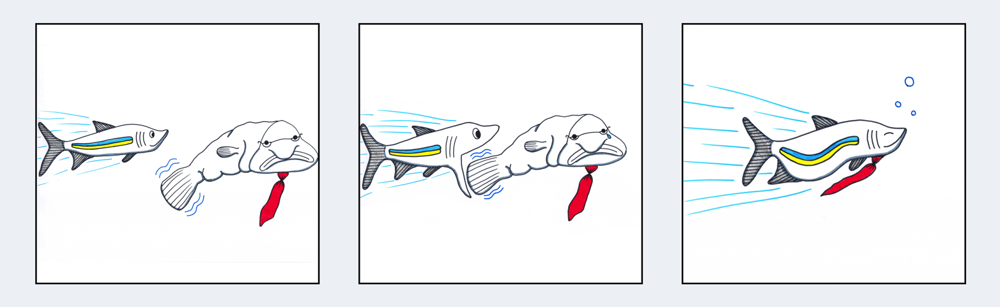

介绍
=============================

当我们别无选择的时候才会去改变一个巨无霸系统（[monolithic system](https://en.wikipedia.org/wiki/Monolithic_application)）[*注1*]的系统, 而不是迅速捉住机会，我们左思右想是否值得打破这种我们称之为企业系统之间微妙平衡。通常机会稍纵即逝，快速的公司就能把握住，就像图1-1

> 在新的世界里，不再是大鱼吃小鱼，而是快鱼吃慢鱼。 --Klaus Schwab

微服务架构有一个概念：它主张创建一个小型的，服务隔离，各自有自己的数据和相互独立，可扩展和高可用的系统。服务与服务之间集成是为了形成一个高内聚的系统，这个系统比我们现今行业建立的典型企业系统更加灵活。

传统企业系统会被设计成一个巨无霸系统--多合一的，孤注一掷的，难以扩展，难以理解和难以维护。巨无霸系统会迅速地变成一个扼杀创新、进步和快乐的噩梦，巨无霸系统的负面影响对于一个公司来说是灾难性的--会降低士气导致高离职率，公司很难请到有能力的工程师从而失去市场机会，甚至在极端的情况下，会导致一个公司的失败。

这个重构战争故事通常听起来是像这样：『在得到我们的管理层同意后，我们最后决定改变我们的Java EE应用。然后我们通过数个多月的冗余的前期设计（[big up-front design](http://www.agilemodeling.com/essays/bmuf.htm)）后我们才开始编码,大部分的时间我们的浪费在努力找出这个巨无霸系统实际做了什么。我们开始因恐惧而失去勇气，担心一个小小错误就导致非计划中和未知的影响。最后，经过数个月担心，恐惧和努力，这个设计终于实现了 --  但是还是一团糟。附带的伤害是我们会不断地从半夜醒来，因为线上了现问题我们需要去救火(firefighting)。』

这是不是似曾相识？

经历了这样的恐惧压迫，我们会越来越麻木。这就是为什么系统和公司停滞不前。还有更好的方式吗？

> 你必要要从用户体验开始，然后回归技术。-- Steve Jobs

微服务的用户就是买入系统的那个人，所以让我开先从用户开始: 开发者，架构师和关键利益相关者。

你是选择从事一个大系统但影响力很小，还是从事一个小型的，定义清晰的系统模块但很有的影响力? 你是选择在一个大的官僚集团努力工作,还是在一个小团队里得到信任吗? 你是选择尽力做好别人的委托，还是在房间里创造性地思考和构建有用的东西吗? 加入微服务吧。

拯救服务化
=============================

> 虽然世界多苦难，但是苦难总是能战胜的。 --Helen Keller

微服务作为下一代软件设计革命不仅仅是因为技术原因。这个思想的词语微服务在我们首次探索（[Service Oriented Architecture (SOA)](https://en.wikipedia.org/wiki/Service-oriented_architecture)）已经出现。之前某技术确实限制了我们谈论微服务这个词,一个机器运行一个处理器，慢网络，昂贵
的硬盘，昂贵的内存还有公司组织结构像巨无霸。但要指出的是在构建系统的过程中用单一职责原则去定义界限明确的组件这个并不是新方式。

直至2016年，技术限制微服务的时代已经过去。网络更快，硬盘更便宜(而且很快)，内存更便宜，多核处理器更便宜还有云架构正在改变我们的设计和部署系统方式，现在我们终于可以按照我们想法去构建系统。

设计和编写程序是有趣的，这就是为什么我们当中大部分人在最初的时候进入软件行业的原因。微服务不仅仅是一系列的原则和技术。这是一个解决系统设计中复杂问题更善解人意的一种方式。

微服务可以像组建我们团队那样组建我们的系统，团队成员之间划分责任，确保他们可以自由进行他们的工作。当我们理顺我们系统之后，我们将完全授权给那些能及时抓住机会的小团队 ,而且能够保持敏捷因为他们很清楚软件的已经定义明确的边界。

拆分巨无霸系统
=============================

解决一个巨无霸系统意味着采取强硬态度看待你的传统Java EE系统。通过一个巨无霸的方式来编写，这些系统的组件服务[*注2*]之间耦合得越来越紧。系统之间的服务相互纠缠和相互依赖导致程序致难以编写, 难以理解、测试、演变、更新和独立发布。更糟糕的是, 紧耦合会导致雪崩(cascading failures) -- 一个服务失败会导致整个系统失败，而不是允许你把失败隔离。 

其中一个问题就是应用服务器（例如，WebLogic, WebSphere, JBoss 和 Tomcat -- 虽然Tomcat不支持EAR文件）都鼓励这种巨无霸模型。他们乐于看到，你打包你们的服务变成JAR包然后放进EAR文件这样的方式去组织服务，然后你部署（就在你所有其他应用和服务旁边）在只运行了单实例的应用服务器上，就是就服务之间的『隔离』通过类加载器（class loader）来解决。总之, 这个是一个脆弱的模型。

现在我们有更加坚实的基础去隔离服务，使用虚拟化，Linux容器(LXC)，Docker和[Unikernel](http://unikernel.org)。这些工具会促使把隔离作为首选变得可能 -- 高可用，可扩展，持续交付和高效运维的前提。它同样为基于微服务架构的流行铺路，助你拆分巨无霸系统然后开发，发布，运行，扩展和管理服务之间的依赖。

SOA的新外衣?
==============================

> “上帝，这衣服多么合身啊！式样裁得多么好看啊！”大家都说。“多么美的花纹！多么美的色彩！这真是一套贵重的衣服!“ -- 出自H.C.Andersen的『黄帝的新衣』

微服务实际上是否只是SOA穿上了一件新的外衣？这是个好问题。答案可以为是或者不是, 说是，是因为最初的目标是一样，解耦，隔离，组合，集成，离散和自治服务。说不是，是因为SOA的基本思想常常被人误解和误用的，导致使系统变得复杂，就像使用ESB（[Enterprice Service Bus](https://en.wikipedia.org/wiki/Enterprise_service_bus)）来联结多个巨无霸系统、过于复杂的通信、低效和僵化的协议。

Anne Thomas 已经在他的博客『SOA已死』描述得很清楚。    

**服务永存** [*注3*]: 

> 虽然SOA（词语）已死，但是面向服务架构（译者注：SOA的全称，重点是服务）的需求比以前的更强烈了。然而容易令人疑惑的语句：以首字母缩写的方式，人们忘记SOA代表什么，他们愚蠢地讨论技术实现（例如，『什么是最好的ESB？』或者『WS-* vs. REST』），但是他们忘记了重要的东西：架构和服务。    
成功的SOA（例如，应用程序重构）要求打破现状。SOA不是简单认为是一种新部署技术，在原有的应用上创建服务接口。它要求重新设计应用程序的结构（application protfolio），同时它要求运维操作发生巨大改变。

很多软件架构师都觉得SOA已经跟10到15年前SOA刚出现时不一样了。现今，多核处理器，云计算，移动设备和物联网(IoT)发展迅猛，这意味着终有一天所有系统都是分布式的 -- 一个截然不同的、更具挑战性的世界去实现它。

通常地，新的挑战要求新的思维方式然而我们已经看到新系统出现，它们的设计用于这些新的挑战 -- 系统建立在反应式法则，按照反应式宣言([reactive manifesto](http://www.reactivemanifesto.org))[注4]。

响应式法则不是一种新的思维。它们应该被证实和久经沙场超过40年了，回到Carl Hewitt杰出贡献和他发明的Actor模型，Jim Gray和Pat Helland的Tandem系统[*注5*]，还有Job Armstrong 和Robert Virding贡献的Erlang。这些人都是那个时候的佼佼者，然而现今世界已经迷上他们的创新性的思想,我们比以前什么时候都依靠他们的发现和贡献。

微服务之所以引人关注是因为这个架构吸取SOA的成功与失败的教训，使得这思想更加完善和根据响应式法则和现代化的基础设施来彻底地重构它们。总而言之，微服务是近年来遵从反应式法则的最令人注意的系统之一。

-----------------------------------------------------

[注1]. 译者注：monolithic 中文翻译纠结了好久，曾经想过单机版，庞然大物，集中式，最后译作巨无霸。     
[注2]. 在这文档中微服务和服务两个概念是相通的。他们都指的是响应式服务。     
[注3]. 『[SOA已死，服务永存)[http://apsblog.burtongroup.com/2009/01/soa-is-dead-long-live-services.html]』出自Anne Thomas, Gartner公司的副总裁和著名的分析师。    
[注4].『响应式宣言』地址在www.reactivemanifesto.org。如你没有访问过，推荐你阅读一下因为这本书是依靠响应式原则作为基础。    
[注5]. [Fault Tolerance in Tandem Computer Systems](http://www.hpl.hp.com/techreports/tandem/TR-86.2.pdf)
