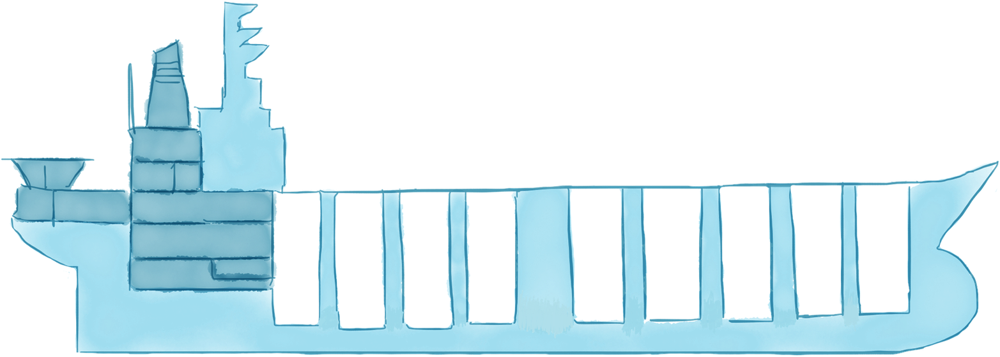
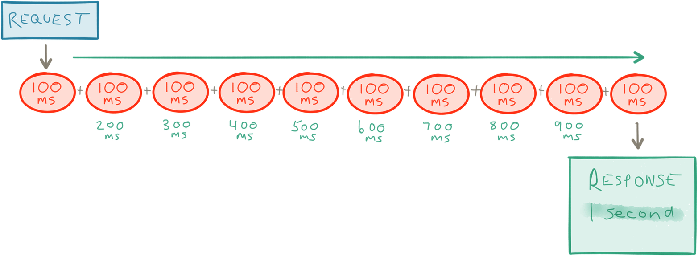
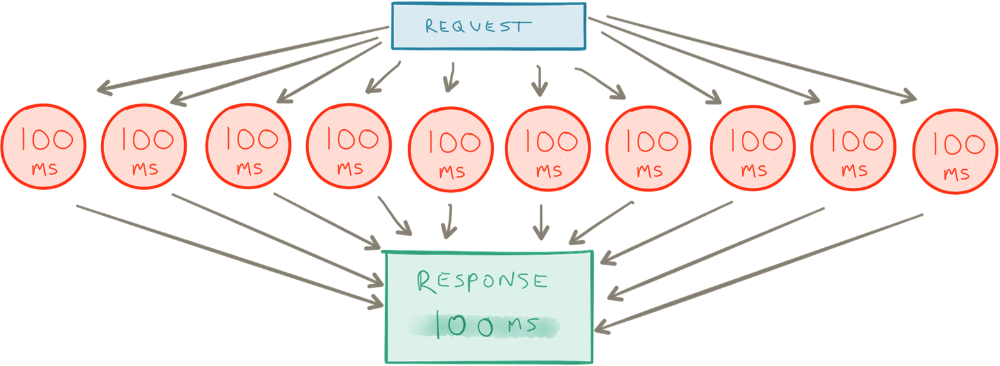

响应式微服务是什么？
=========================== 
采用基于微服务架构一个重要原则是分而治之（[Divide and Conquer](https://en.wikipedia.org/wiki/Divide_and_conquer_algorithms)）：把系统的组件打散然后隔离成子系统，它们之通完清晰的协议进行通信。

隔离是实现高可用和可伸缩性的先决条件，它要求服务之间用异步通信的方式来解耦：

*时间*    
    可以并发

*空间*    
    可以分布式和可移动的（可随意移动服务的能力） 

当我们实现微服务，它的本质就是消除共享易变状态（shared mutable state）[*注1*]从而使协调（coordination）、资源竞争、和一性成成本最小化，这些在非共享架构（[Shared nothing architecture](https://en.wikipedia.org/wiki/Shared_nothing_architecture)）中的通用可扩展性系统法则（Universal Scalability Law）[*注1*]有所定义。		

这个观点会贯穿全文，是时候让我们来讨论响应式微服务最重要的部分了。

隔离所有
===========================

> 没有伟大的孤独，哪有严肃的作品 ---  巴勃罗·毕加索

隔离是非常重要的特质，它是微服务许多高层优势（`high-level benefits`）的基础，然后它同时是影响你的设计和架构的最大因素。它会（应该）分解整个架构，因此一开始就要考虑它。它甚至会使你打破原来方式，重新组建团队和分配职责，正如梅尔文.康威（`Melvyn Conway`）的发现，然后在1976年编写了[康威定律](http://melconway.com/Home/Conways_Law.html)：   

> 设计系统（广义上的系统）的组织，其产生的设计和架构等价于组织间的沟通结构。 

失败隔离，控制和管理工作流的服务失败防止级联失败 --- 这模式有时候会提到*舱壁*这概念。

舱壁已经在船身结构设计运用好几个世纪了，例如这样的方式『建造水密舱，当船外壳被破坏或其他裂缝的情况可以控制进水情况』[*注3*]。船身被分为截然不同、完全隔离的水密舱，裂缝不会扩散，般可以继续运行到达目的地。

有人会认为泰坦尼克号就是个反例。实际上，有个有趣的研究[*注4*]表明了当你没有适当的隔离舱是如何导致级联失败，最后导致整个系统崩溃。泰坦尼克号确实是使用舱壁技术，但是水密舱的墙壁假设水位不会超过开花板。所以当十六分之六的水密舱被冰块刺穿，整艘般开始倾斜，水从一个水密舱溢出到另外一个，直到所有水密舱都充满了水然后下沉，造成1500死亡。

恢复力，从失败中自愈的能力，通过隔离和围堵失败，同时为了达到这个目标只能是打破同步通信（[synchronous communication](https://en.wikipedia.org/wiki/Synchronization_(computer_science))）带来的强耦合。微服务在程序边界通过异步消息传递能实现间接调用，与捕获和管理失败中解耦。针对平常的流程，使用服务监督（`service supervision`）[*注5*]。

服务之间隔离使持续交付变得自然，它允许我们安全地一个接一个发布程序、减小节点、回滚。

隔离还可以使服务之间更容易扩展，同样允许他们自监控、调试和独立测试（笨重的单体系统中的服务都缠在一起，这是很难道做到这一点的）。

自治性
=========================

> 要只按照你同时认为也能成为普遍规律的准则去行动... -- 康德自律法则

隔离是自治的法则。只有当服务隔离了才会完全独立自治、行动独立、配合和协调其他问题。

一个自治服务（[autonomous service](https://en.wikipedia.org/wiki/Service_autonomy_principle)）只能通过发布它的协议或API来许可（`promise`）[*注6*]自己的行为。拥抱这简单而又基本的事实，对我们如何理解与自治服务之间协作有深远的影响。

自治性的另外一面在于，服务只会保证它们自己的行为，然后它自己要解决数据冲突或者当失败的时候能恢复，不需要通信或协调。

使用自治性的服务可以使开辟了在服务编排的灵活性、流程管理和协同行为，同样可以水平扩展、高可用和运行时管理，定义清晰和可组成的API来通信，还有维护一致性，这会有一点挑战，不久我们将会讨论。

单一职责
========================

>这是Unix哲学：所编写程序要只做一件事，并将其做好。编程同样如此 --- 道格.罗伊

Unix哲学[*注7*]和设计已经非常成功，提出几十年后仍然反响热烈。它其中一个关键原则就是开发者应该编写程序只有一项目标、很小但是具备定义清晰的责任并且能够很容易地与其他小程序进行组合。

这个理念后来纳入Robert C.Martin面向对象编程并称之为单一职责原则（SRP）[*注8*]，这个声明一个类或者组件应该是『只有一个原因会导致其改变』。

已经有很多讨论的一个微服务的正真规模。什么称之为『微』？多少行代码才能称为微服务？这些都是错误的问题。『微』应该指的是职责的范围，Unix的哲学单一职责可以作为指导原则：只做一件事，并把它做好。

如果服务只会因为单个理由而存在，提供一个可组合的功能，业务模型和职责就不会纠缠不清了。每个服务都可以更广泛使用，系统作为一个整体更容易水平扩展、高可用、容易理解、容易扩展和维护。

不共享状态
========================

> 没有隐私，一个独立个体就没有意义。 --- Jonathan Franzen

到目前为止，我们把微服务作为一系列离服务，每个都有单独一项职责。这种形式可以把服务作为一个单独的单元，它们的生命周期都被隔离（可弹性的先决条件），移动可以隔离（可扩展性的先决条件）。

虽然这一切听起来很好，但我们忘记房间里的『大象』：状态。

微服务通常是有状态的实体：它们包括状态和行为，类似的方式是[Object](https://en.wikipedia.org/wiki/Object-oriented_programming)或者[Actor](https://en.wikipedia.org/wiki/Actor_model)，相互之间通过申请状态和请求来隔离，这要求你把状态和行为作为一个独立单元。

不幸的，有种架构忽略这点名叫『无状态』 -- 『无状态』的控制使服务把它们的状态推向一个大型共享的数据库，就像很多Web框架那样 -- 不会帮你解决太多你要想的东西，只会把问题委托给第三方，并且难以控制（包括保证数据完整性、扩展性和可用性保证）

我们需要每个微服务都负责自己的状态和持久化。把每个服务就当作一个界限上下文[*注9*]是很有用的，因为每个服务都定义它自己的域，每个都有自己的通用语言。这些技术都来自领域驱动设计（[Domain-Driven Design，DDD](https://en.wikipedia.org/wiki/Domain-driven_design)）[*注10*]模型构建工具。这里介绍的所有新概念都来自这里，考虑DDD学习一个很好的起点。DDD对微服务有着深远的影响，许多在微服务里听到的词语都来源于DDD。

与其他微服器通信应该通过限界上下文，你只能友好地请求一下它的状态（你不能强迫暴露它）。每个服务它会自己响应请求，从它的当前状态衍生的不变数据（事实），同时从来不会直接暴露它的可变状态。

这样，每个服务可以自由地用什么方式来展示它的状态，使用合适的格式化和半格式化地存储。有些服务可能会选择一个在传统的关系数据库管理系统（[RDBMS](https://en.wikipedia.org/wiki/Relational_database_management_system)），如Oracle、Mysql和Postgres。有些是[NosSQL](http://nosql-database.org)数据库（如[Cassandra](http://cassandra.apache.org)和[Riak](http://basho.com/products/)），有些是时序（[Time-Series](https://en.wikipedia.org/wiki/Time_series_database)）数据库（如[InfluxDB](https://influxdata.com)和[OpenTSDB](http://opentsdb.net)），有些使用Even范t Log[*注11*]（很好的后端支持包括[Kafka](http://kafka.apache.org)，[Amazon Kinesis](https://aws.amazon.com/kinesis)和Cassandra），来实现Even(t Souring[*注12*] 和 命令与查询职责分离（CQRS）。

分散式的数据管理和持久化有很多好处 --- 有时候称为*混合持久化*。从概念上，用哪个存储中间件并不重要，最重要的是服务能够看作是一个独立的单元（包括状态和行为）。为了每个服务都有自己的状态，非共享的。这需要服务不能直接访问另一个服务的持久化存储，只能通过API --- 有时候很难给程序自动强制的，因此需要通过会议、规则和代码审核来完成。

*事件溯源（Event Log）* 是消息的持久化存储。我们可以选择当消息（服务的Command）进入服务的时候存储，一般称之为*命令溯源*。我们同样可以选择忽略命令，让它执行服务的副作用，如果副作用触发一个服务里的状态改变，我们能够捕捉这状态改变看作事件里一个新的事实，这个会存储在事件日志里，这时使用事件溯源。

消息被存储成有序，提供服务之间交互的全部历史，因为消息大多数据时候都代表服务的事务，事件日志本质上给我们提供了一个事务日志，这个日志能够显示地查询、审计、弹性发布时用于重放消息（从任意的时间点）、调试和复制 -- 而不像RDBMS那样地需要使用者抽象出来，Pat Helland 充分证明这点：

> 事务日志记录着数据库的所有改变，只能通过高性能地添加来改变日志。从这个观点来看，数据库的内容只是维护日志里的最新记录内容的缓存。日志才是真相。数据库日志子集的一个缓存 。这缓存子集是每条记录的最后的值和日志的索引。[*注13*]

命令溯源和事件溯源有着不同的语义。例如，重放命令意味着你同样重放着它们所代表副作用；重放事件只是执行状态改变操作，加速服务的状态的变化。根据不同的用户场景来选择最合适的技术。

使用事件日志同样能够避免对象-关系阻抗不匹配（[Object-Relational Impedance Mismatch]()），一个发生在[Object-Relational Mapping, ORM]()技术的问题。还可以建立消息传递通信的基础，然而这已经是主要通信机制的事实。使用事件日志同样也是微服务最后的存储模型，因为它天生支持异步消息传递通信（请看图2-4）

异步信息通信
========================

> Smalltake 不仅没有语法或者类库，它甚至没有类。我对于很久之前杜撰了词语『对象』而道歉，因为这导致很多人不关注这个理念，这个理念就是『消息传递』 --- Alan Kay

微服务之间通信需要基于异步消息传递来通信（虽然每个微服务内部逻辑使用同步模式来执行）。正发前面我们提过的，服务之间需要通过异步限界来解耦它们，它们进行流程通信。在时间允许并发，在空间允许分布式和可移动。没有这种解耦就不能做做大量并行和控制所需要的隔离和可用性。

异步（[Asynchronous]()）和非阻塞（[non-blocking]()）效率高，因为IO更需要消耗资源。它们帮助我们在系统共享资源中最小化地减小竞争或拥（这是可扩展性、低廷时和高吞的最大障碍）。

举个例子，让我们假设一个服务对其他十个服务产生十个请求然后组合它们的请求，每个请求花费100毫秒。如果它需要同步模式来执行这些请没地方，那么总处理时间大约是一秒。（请看图2-5）

如果它可以异步地执行，处理时间只需要一百毫秒 -- 一个数量级的差异，因为客户不同的初始化请求（图2-6）

但是为什么说阻塞不好？

最好用一个例子来说明。如果一个服务调用另外一个服务产生了阻塞（需要等待结果返回）--- 它会占用线程。这意味着在这个执行周期内线程不能做任何事情。线程是稀有资源，需要尽可能地有效使用。如果服务使用异步和非阻碍模式调用，它就可以释放当用线程，然后做其他事件直到结果返回。它会更加有效地使用（减小线程成本、提高性能），图2-7

特别要指出的是，服务之间不同资源不同服务边界使用异步通信是非常得要的。为了充分利用非阻塞优势，所有的请求链应该拆分，包括请求分发，通过服务实现，下至数据库和后端。

异步消息传递帮助我们产生约束条件（尤其是失败场景，网络编程的第一课），而不是用*抽象漏洞定理*[*注14*]的隐瞒或者假装它们不存在（就像同步[PRC](https://en.wikipedia.org/wiki/Remote_procedure_call)的谬论[*注15*]）。

异步消息传递另外一个好处就是，它会将焦点转向工作流和沟通模式的应用和帮助你考虑协作，不同服务之间如何数据流传，它们的协议和交互模式。

不幸的是[REST](https://en.wikipedia.org/wiki/Representational_state_transfer)广泛地认为微服务默认的通信协议。要知道REST通常都是同步的，不太适合服务内部之间通信。REST对于少数服务或者紧耦合的服务场景或者是一个选择，但是尽量少用，外部它需要请求/响应模型，要知道这牺牲了解耦、系统进化和可用性[*注17*]

异步消息通信的需求不仅仅包括回应单个消息或请求，还要持续提供消息流，替在地无界流。在这几年来流被不断被包装成产品，但是流的正真的定义是什么。[*注18*]

根本性的改变是，我们从『数据静止』转变为『数据流动』。数据通常都用于离线和在线。今天的应用需要近实时地响应数据改变（当它出现，在内部数据近实时执行持续的查询或聚合，然后把结果回到应用的影响操作）。

大数据第一阶段是『数据是静止』。我们把记录大量存储到HDFS或者相似的系统，它们需要隔夜来执行离线批量处理，通常是几个小时延迟。

第二阶段，正如我们所看到那样，需要近实时地响应数据『数据是流动』，捕获流动的数据，处理它然后在秒级甚至在次秒级内把结果返回到运行的系统（这个越来越重要）。

这需要使用混合的架构，就像[Lambda架构](http://lambda-architecture.net)，有两层含意：用于实时在线处理的『加速层』和用于完全离线处理的『批量处理层』；这就是从『加速层』实时处理然后合并到『批量处理层』。这个模型解决一些实时需要快速反应（最小子集）的数据。但是需要增加维护两个独立模型和数据处理管道的复杂性，同样数据需要在最后合并。

第三阶段，我们已经开始并且而已发生了，完全内嵌『数据在流动』，对于大多数据场景和数据大小，从传统面向批处理架构向流处理架构迁移。

这个模型对于基于微服务架构非常吸引，因为给它带来了一种流的力量，服务之间『数据在流动』，这两者都是一种通信协议，同样也是一个持久化解决方案（通过事件日志，在前面部分已经讨论过）--- 包括了客户端到服务和服务到服务的通信。

位置透明
===================

>去走动、去呼吸、去飞翔、去漂流，   
去付出和获得，    
在遥远异国的道路上徘徊,   
旅行即生活。    
--- 安徒生  

随着云计算、虚拟化和Docker容器，我们有很多手段来有效地管理硬件资源。问题是，如果我们微服务及其底层平台不能有效利用，一切都没有意义。所以我们的服务需要位置透明，允许他们能够变得弹性。

我们已经谈论了异步信息传递，这能够给时间和空间提供解耦。后者，空间解耦，也称之为*位置透明*[*注19*]，微服务能够在运行时，动态扩展（无论是多核或多节点，不需要改变代码）。这就是分布式服务能够可弹性和移动性；它需要允分利用云计算和现收现付制的模式。

由于服务变得位置透明所以它需要位置可变的。但是这是表示什么意思？

首先，位置需要稳定，在某种意义上用于指的是服务不间断，不管目前的所在地。这需要维持是真实如服务是正在运行中、已经停止、被挂起、正在升级、已经崩溃等等。地址应该一直运行（图2-8）。这意味着一个客户通常能够发送消息到一个地址。在实践中，我们可能有时间放进队列、再次提交、日记记录或者发送到一个死箱队列（[dead letter queue](https://en.wikipedia.org/wiki/Dead_letter_queue)）

然后，一个地址在广义上尽量需要被*虚拟*，通常都是这样做，不仅仅代表一个，但是一整套一起定义了服务的运行时实例。这些优势包括：    

*无状态服务实例之间负载均衡*

如果一个服务是无状然后它不需要关心哪个实例实际请求，大量的轮询算法可以实现，就像循环，广播或者基于指标。

*有状态服务实例之间主动-被动状态复制（[replication]()）*[*注20*]

如果一个服务是有状态的然后它要严格地轮询 -- 每个请求都发送到一个明确的实例。这个模型同样要求每个状态都能够到达服务实例（副本，每个都准备着接管着故障转移的请求）。

*有状态服务的迁移*

服务实例从一个位置到另外位置是非常有益的[*注21*]或者有效利用资源。

使用虚拟地址意味着客户端可以不关心这些低层次（Low-Level）的运行时所关心 --- 服务之间通过一个地址来通信，不需要关心最新配置怎么样或在哪里操作。

----------------------------		
[注1]. 一次对易变状态产生的问题的深入讨论，请看John Backus的经典图灵奖演讲『[编程可以从冯诺依曼风格中解放出来吗？](http://delivery.acm.org/10.1145/360000/359579/a1977-backus.pdf)』 

[注2]. Neil Gunter的通用可扩展性系统法则（[Universal Scalability Law](http://www.perfdynamics.com/Manifesto/USLscalability.html)）是理解一致性和协调对并发和分布式系统的影响的重要途径。

[注3]. 在船身结构运用隔板的讨论，请看WIKI页面[Bulkhead](https://en.wikipedia.org/wiki/Bulkhead_(partition))

[注4]. 深度分析泰坦尼克号沉没的原因，请看[泰坦尼克号快速沉没的原因和影响](http://writing.engr.psu.edu/uer/bassett.html)

[注5]. 单元（服务）监督在Actor语言（像Erlang）和类库（像Akka）用于管理失败。监督者层级模式以分层的方式在父进程监督下组织单元（Actor/Service），请看[监督与监控](http://doc.akka.io/docs/akka/snapshot/general/supervision.html)

[注6]. 我们的定义来自于Mark Burgess（OReilly）的[Thinking in Promises](http://markburgess.org/TIpromises.html)中的章节『Promise Theory』，这个对于建立和理解集中式和协调系统很有用。它告诉我们,让我们拥抱不确定性,这样才能朝着更大的确定性。

[注7]. Unix哲学已经在Eric Steven Raymond（人们出版社）经典书藉[The Art of Unix Programming](http://www.catb.org/esr/writings/taoup/html/)

[注8]. 一次对单一职责的深入讨论，请看Robert C.Martin的网页[The Principles of Object Oriented Design](http://www.butunclebob.com/ArticleS.UncleBob.PrinciplesOfOod)

[注9]. 访问Martin Fowler网站可以得到更多如何使用[限界上下文](http://martinfowler.com/bliki/BoundedContext.html)和[通用语言](http://martinfowler.com/bliki/UbiquitousLanguage.html)模型工具的信息。

[注10]. 领域驱动设计（DDD）在Eric Evans的书[领域驱动设计——软件核心复杂性应对之道](https://www.amazon.com/Domain-Driven-Design-Tackling-Complexity-Software/dp/0321125215?ie=UTF8&*Version*=1&*entries*=0)有介绍。

[注11]. 请看Jay Kreps的的文章[日志：每个软件工程师都应该知道的有关实时数据的统一抽象](https://engineering.linkedin.com/distributed-systems/log-what-every-software-engineer-should-know-about-real-time-datas-unifying)

[注12]. Martin Fowler已对[Event Sourcing](http://www.martinfowler.com/eaaDev/EventSourcing.html)和[CQRS](http://martinfowler.com/bliki/CQRS.html)描述得很清楚。 

[注13]. 引用来自Pat Helland富有洞察力的论文[不变性改变任何东西](http://cidrdb.org/cidr2015/Papers/CIDR15_Paper16.pdf)

[注14]. 在Joel SPolsky的经典文章『[抽象漏洞定理](http://www.joelonsoftware.com/articles/LeakyAbstractions.html)』中有详细说明。

[注15]. RPC的谬论由Steve Vinoski的『[Convenience over Correctness](http://steve.vinoski.net/pdf/IEEE-Convenience_Over_Correctness.pdf)』文章来解释最好不过了。

[注16]. REST本身只能使用同步通信，没什么什么办法可以改变，但是它几乎是业界最常用的方式。

[注17]. 请看第三章节*集成*，那里有讨论如何给同步协议的客户端做接口。

[注18]. 我们使用Tyler Akidau对流的定义，来自的文章[The world beyond batch:Streaming 101](https://www.oreilly.com/ideas/the-world-beyond-batch-streaming-101)『一种数据处理引擎，它为无限数据集合而设计』

[注19]. 位置透明是相当重要的原则，但常常被忽略和不受重视。对这最好的定义你可以从响应式宣言来找到，在这[章节](http://www.reactivemanifesto.org/glossary#Location-Transparency)

[注20]. 有时候指的是『Master-Slave』，『Executor-Worker』，『Master-Minion』复制 

[注21]. 局部访问在构建高性系统中一项很重要的技术。有两种局部访问方式：时间,特定数据的重用；和空间,保持数据在空间相对较近。重要的是要理解和优化的。
