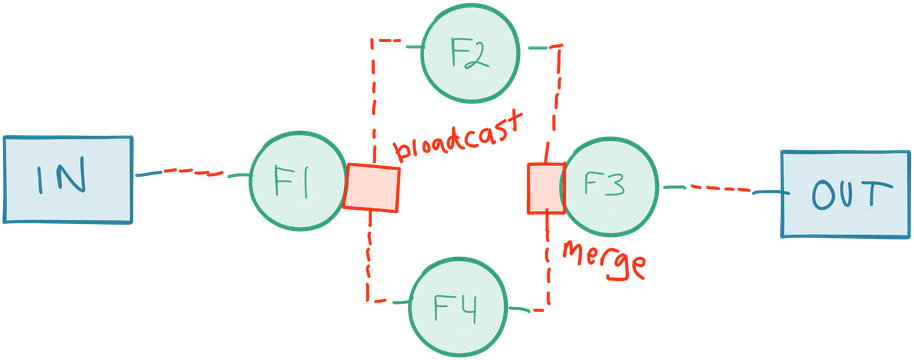
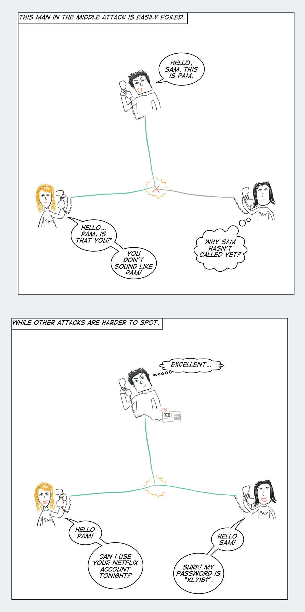

构建微服务
=======================

> 单独的Actor对象不是Actor对象，在Actor系统，Actor对象才是Actor对象。    
-- Carl Hewitt

> 没谁只是一座小岛，   
完全能自保；   
人人都是大陆一块宝，   
整体少不了。   
-- John Donne

至今我们已经对响应式微服务有了很好的认识了。然而按Carl Hewitt的话来说：*单个微服务不是微服务，在微服务系统里，微服务才是微服务*。像人们那样行为独立，所以需要互相通信和协作来解决问题。微服务之间像人们那样合作，这是最有趣的机会以和具有挑战性的问题。

单机版的微服务很容易设计和实现，基于微服务架构难点在于如何把它们串连起来：服务发现、协调、安全、复制、数据一致性、故障转移、部署、与其他系统集成，这些只是其中的一些。

挖掘现实
=================

> If you cannot solve a problem without programming. You cannot solve a problem with programming.     
> -- Klang’s Conjecture by Viktor Klang 

基于微服务架构的优点之一就是给你提供一系列的工具来挖掘现实，通过模仿世界是如何工作来构建系统，包括所有的约束和因素。

我们已经讨论过的康威定律的重点是，当你们组织结构和部门已经准备好了，微服务开发通常是很适合你们的。

另外一个微妙之处，更重要的是接受现实是不一致这点，没有什么东西是绝对的，所有事情都应该是相对的，包括时间和我们现在的经历*[注1]*

信息不可能跑得比光的快，往往要慢得多，这就意味着信息的通信会有延迟*[注2]*。信息通常来自过去，当你想到它的时候，事情已经变成事实。当我们意识或者认识到这些影响，它已经发生了。我们常常都是寻找过去，『现在』只在旁观者的眼里。

微服务会成为现实的一条退路。在单个微服务，我们生活在确定性的安全岛和强一致（[strong consistency](http://www.bailis.org/blog/linearizability-versus-serializability)，请看[ACID](https://en.wikipedia.org/wiki/ACID)）, 这是能够高兴地生活在时间和现在是绝对的这样的安全岛。（请看图3-1）

然而，只要我们离开单个微服务的限界就会进入广阔的『不确定性』海洋（分布式的世界，与众不同的世界）。你可能已经听说过构建分布式系统是困难的*[注4]*。是的，正如前所言，同样有一个世界提供了我们可回复性、弹性、隔离的解决方案。从这点来看，我们不能回到单体系统，而是学习如何正确地运用一些原则 、抽象和管理工具。

Pat Helland谈论过这个*[注5]*，他用『内部数据』和『外部数据』的对比来说明这点，内部数据是『当前本地表现』，外部数据（事件）是『对过去的回忆』，而服务之间的命令是『对将来的期望』。

> 过渡到面向服务构架夺最大挑战之一就是令到程序员明白他们已经别无选择，只能明白在外部，『当时』数据是来自其他服务，『现在』在服务内部。     
--- Pat Helland

让我们想象一下，我们创建一系列的微服务，是时候把它集成起来成为一个系统。有哪些重要的事情我们需要我们去弄明白和实施呢？

服务发现
=========================

> 创新最大的障碍不是无知，而是对知识的幻想。    
--- Daniel J.Boorstin

**现在我们有一系统的微服务需要去协调，有什么可以帮助我们地定位它们？**

为了和其他服务通信，一个服务需要知道其他服务的地址。最简单的方法是所有用到的服务硬编码物理地址和端口，或者在启动的时候把它们写到配置文件。这个解决方案的问题是它会形成一个静态发布模型，这个模型与我们达成微服务的一切事情相矛盾。

服务之间需解耦和可移动性（`mobile`），系统需要弹性和动态的，这可以通过增加一个中间层来解决，这个模式称之为控制反转（[Inversion of Controller, Ioc](https://en.wikipedia.org/wiki/Inversion_of_control)）。这意味着每个服务实际上应该上报当前地址和连接信息给平台。这称之为服务发现（[Service Discovery](https://www.nginx.com/blog/service-discovery-in-a-microservices-architecture/)）
，这也是基于微服务平台的基本部分。

一旦服务的信息已经被持久化，就可以通过一个服务注册（[Service Registry](http://microservices.io/patterns/service-registry.html)）查找到信息，这种模式称为客户端-服务发现（[Client-Side Service Disacovery](http://microservices.io/patterns/client-side-discovery.html)）。另外一个策略需要信息存储和在一个负载均衡器（`load balancer`，像在[AWS Elastic Load Balancer ](https://aws.amazon.com/elasticloadbalancing/)）或者直接在服务地址引用 （使用依赖注入的方式注入），这种模式称为服务端-服务发现。

**当我们选择一个服务发现的工具的时候，主要考虑哪些因素？**

其中一个存储服务信息的方式是通过基于CP*[注6]*（强一致性）配置存储*[注7]*。这个是简单的方式，因为你要所有的信息都在一个地方，都在一个原子结构里。但是这通常要求你保证强一致性*[注8]*，这会增加可用性的成本，还会需要额外的基础设施集群来发现和管理。

更好的方式是依靠分布式的基于AP*[注9]*的P2P（[Peer-to-Peer](https://en.wikipedia.org/wiki/Peer-to-peer)）技术，像流行的[Gossip](https://en.wikipedia.org/wiki/Gossip_protocol)协议，有时候还与CRDTs*[注10]*（Conflict-Free Replicated Data Type）来简化信息的传递，使用最终一致性（[eventually consistent](http://www.allthingsdistributed.com/2008/12/eventually_consistent.html)）和弹性的方式（不需要额外的基础设施）。*[注11]*

API管理
=========================
> 发送时保守，接收时开放。 --- Jon Postel

**当微服务随着时间独立升级，管理服务协议和API有什么挑战？**

单个微服务只有当他们能够独立升级才能互相独立和解耦。这个要求它们数据和[协议](http://www.reactivemanifesto.org/glossary#Protocol)能够有回复性（`resilient`）的和随意改变（例如，持久存储的数据和广义的临时信息*[注12]*）。实际上，不同版本之间的协作，决定着是否能够长效管理复杂的服务规划。

伯斯塔尔法则*[注13]*，也称为鲁棒性原则，描述如下『发送时保守，接收时开放』，对于服务协作中的API设计和升级都是一个很好的指导*[注14]*。

这里的挑战包括协议和数据的版本，还有如何处理协议和数据的升级和降级。这是一个涉及面较大的问题，包括可扩展的序列化编码、协议维护、数据转换层，有时候甚至服务本身版本升级。*[注15]*。这在DDD中称为『隔离层，[Anti-Corruption Layer](https://moffdub.wordpress.com/2008/09/21/anatomy-of-an-anti-corruption-layer-part-1/)』，可以追加到服务自己本身或者在API GateWay完成。

**假如我有这样一个客户端，为了执行一个任务，需要调用十个不同的服务，每个服务都有不同的API。听起来很复杂，我能如何简化API管理？**

基于微服务的大型系统常常会遇到的场景，这会导致客户端增加不必要的复杂性。针对这些场景最好的方式是，不需要客户端直接与微服务通信，直接让它调用[API Gateway](https://www.nginx.com/blog/building-microservices-using-an-api-gateway)服务[*注16*]，请看图3-2

API Gateway负责接收客户端的请求，路由到正确的服务（如果需就进行协议转换），组合结果然后返回给客户端。

这模式的优势在于，通过封装服务的内部结构和它们的API，来简化客户端到服务的协议。如果使用一个集中式的方案很难做到高可用和可扩展性的。可以使用非中心化的技术来代替，正如之前提及的服务发现。

就像所有核心基础服务一样，不应该开发者自己构建，理想的情况是作为底层平台的一部分。

通信模式管理
=====================
> 日语有个单词叫ma，用于『承前启后』，相当于英文的『interstitial』。构建优秀的可扩展的系统应该专注于如何设计通信模块，而不是它们内部的属性和行为。-- 艾伦·凯（`Alan Kay`，Smalltalk发明人）

**如何处理大量微服务之间高复度杂的通信？**

ESB的角色依然有存在的价值，只是以一种更现代的可扩展性的消息队列的方式。

如果系统只有小量的微服务，可以直接用P2P（[Point-to-Point](http://www.enterpriseintegrationpatterns.com/PointToPointChannel.html)）来完成通信。然而当微服务数量较大，允许他们当中每个直接和其他通信，构架就会迅速变得难以理解和混乱。 是时候介绍一些约束的规则了！这个需要一个在发送者和接收者之间逻辑解耦，通过预定规则在各服务间路由数据。

其中一个解决方案是使用发布-订阅（[Publish-Subscribe](http://www.enterpriseintegrationpatterns.com/patterns/messaging/PublishSubscribeChannel.html)）机制，发布者可以向一个Topic发送信息，订阅者监听这个Topic。可以使用一个可扩展的消息系统（例如Kafak  或者Amazon Kinesis）或者一个NOSQL数据（可以选择AP风格的数据库像Cassandra或Riak）。

在SOA世界，这个角色通常由ESB来担任。然而在这里我们不是用于单体系统间桥接，而是作为服务发布系统（`publishing system`）的支柱，用来广播任务和数据，或者系统间集成和通信总线。例如，通过[Spark Streaming](http://spark.apache.org/streaming/)抽取数据到[Spark](http://spark.apache.org)）。

发布-订阅协议也有不足之处，当你需要更高级的路由（[routing](http://www.enterpriseintegrationpatterns.com/patterns/messaging/MessageRoutingIntro.html)），这样程序员可以在多个服务间自定义路由规则。或者需要每个数据阶段（`Stages`）间转换（`transformation`）、增强（`enrichment`）、拆分（`splitting`）和合并（`merging`）（使用[Akka Streams](http://doc.akka.io/docs/akka-stream-and-http-experimental/2.0.1/scala/stream-index.html)或者[Apache Camel](://camel.apache.org)）。请看图3-3

集成
===================
> Nature laughs at the difficulties of integration. -- Pierre-Simon Laplace

**如何集成多个系统？**

大多数系统需要一个与外界的通信的方式，不管是消费和（或者生产）信息从（到）其他系统。

当与一个外部的系统通信，特别是一个无法控制的系统，你把你自己处于危险的地步。当通信从[happy path](://en.wikipedia.org/wiki/Happy_path)分发（当事情可以失败，当系统负载过高等等），你永远都不能确定其他系统的行为。你甚至不能相信其他服务通过被证实的协议。所以你可以看到，为什么采取预防措施来保证安全是非常重要的。

第一步，定义一个能在系统高负载或负载非正常增长时，只会产生的最小化危险的协议。如果使用同步协议（甚至只是协议的子集），你会引入了紧耦合，然后你就无能为力，任由其他系统摆布。

避免级联失败，要求服务之间完全解耦和隔离。最好的办法是使用一个全异步的通信协议。相当重要的是，这个协议有一个机制可以容纳大量的流程数据请求，这个称之为背压（`[back-pressure](http://www.reactivemanifesto.org/glossary#Back-Pressure)`）。这个保证为个高性能系统不会因某个慢组件而引起负载过高。越来越多的工具和类库开始拥抱[Reative Streams](http://www.reactive-streams.org)规范（类响应式流的产品包括Akka Streams，[RxJava](https://github.com/ReactiveX/RxJava)，Spark Streaming和Cassandra drivers）。这些使桥接各个系统使用利用实时流来实现全异步得可能（增强交互、可靠性和组合其他系统成一个整体）。

对于管理失败服务的方式同样至关重要。如果能捕捉错误，你可以重试。如果错误持续，在一个特定的周期里隔离这些服务，直到服务恢复，这个抽象的方式称为断路器模式（Circuit Breaker pattern*[注17]*，生产环境级别的断路器实现可以参考[Netflix Hystrix](https://github.com/Netflix/Hystrix)和[Akka](http://doc.akka.io/docs/akka/snapshot/common/circuitbreaker.html)）。请看图3-4。

在过去，集成的角色都是由平面文件（`flat files`，译者注：这些无格式文件可以在文本编辑器中查看，通常会使用这些文件向数据库中加载数据。）承担，或者依赖集中式服务就像关系型数据库或者ESB。但随着扩展性、吞吐量和可用性的要求提高，很多系统都使用非中心化的策略来集成（例如，基于HTTP的REST服务和[ZeroMQ](http://zeromq.org)），或者现代的、集中式的、可扩展和弹性的发布-订阅系统（像Kafka和Amazon Kinesis）。

系统集成还包括最近流行的使用事件流平台，这个理念来自于[Fast Data](http://lightbend.com/big-data-evolved)和实时数据管理。

**客户端到服务的通信，同样需要异步吗？**

通过这本书，我们已经强调需要异步通信、异步执行和异步IO。在服务之间依靠异步消息传递通信相当简单，因为需要全部控制通信协议和实现。但是当外部客户端我们通常不用那么奢华，很多客户端，像浏览器、应用等都是同步通信，在这种情景使用REST通常是个很好的选择。

特别要指出的是，不要全部使用同步客户端通信，而是应该单独地考虑和估算每个客户端用户场景*[注18]*。有很多场景开发人员还是习惯于使用同步的方案，而不是真的有需要，因为简化工作或者更好的交互。

有些场景天生的异步但是传统却把它当作同步，包括：库存信息（如果它很热销，库存减小得很快，用户通常需要被通知）；餐馆里的当前菜单（如果它们改变，用户可能想马上知道）；网站的评论（通常是评论完实时显示）；还有广告（马上回应或根据用户如何使用这网页而改变）。

我们需要独立地看待每个用户场景，搞清楚客户端与服务之间用什么方式调用是自然。这通常要求分析数据完整性约束，找机会去弱化一致性（有序）的约束（可以利用因果关系和读已所写*[注19]*），目的是寻找协调约束的最小集合，为用户提供直观的语义：找到挖掘现实的最好策略。

安全管理
=========
> The users going to pick dancing pigs over security every time. Security is not a product, but a process. -- Bruce Schneier

**要是有人问我们如何才能保证不是所有服务都可以调用结算服务，我们应该怎么做？**

区分认证和授权是非常重要的。认证是保证一个客户端（用户或服务）它的身份是否正确的（通常使用一个用户名和密码）。授权是允许或拒绝用户访问指定的资源。

它们两个都需要工作正常和需要相互合作都是非常重要。有许多方式可以实现他们，每个方式都有它们自己的优点和缺点。

TSL客户端认证（[TLS Client Certificates](https://en.wikipedia.org/wiki/Transport_Layer_Security)），也称为共同认证或者双向认证，可以为内部服务认证提供一个很坚实的安全解决方案，这个方案就是部署的时候为服务提供一个私有的Key和证书。在这策略，不仅服务器需要验证客户端的身份，客户端也需要验证服务器身份。这意味这策略是安全，不仅仅防止窃听，也可以预防一个不友善的网络攻击来网络拦截和重定向请求（例如网络本身，请看图3-5）。SSL通信可以防止窃听、开放的、易于理解的标准，但是管理复杂，优势在于支持支持底层平台。

如果服务是基于HTTP，他们可以使用[HTTPS Basic认证](https://en.wikipedia.org/wiki/Basic_access_authentication)。这同样是易于理解和简单的，但是对于管理所有机器SSL证书很复杂，而且反身代理不再对请求做缓存。

其中一个优势是它提供双向认证，这个与客户端证书方案非常似，在发送证书之前，客户端使用服务器的证书来认证服务器的身份，而服务器使用客户端发送的证书来认证客户端。

另外一个方法是使用*非对称加密算法*。在这方案，每个服务都拥有自己私钥，这私钥用来请求时签名。而每个服务的公钥则由服务发现来产生。这个方案的缺点是，就像一个专用的解决方案，它很容易被窃听或者如果你的网络被攻破就会产生请求重复攻击。

最后，基于安全的*共享密钥*，或者使用基于[Hash Message Authentication Code,HMAC](https://en.wikipedia.org/wiki/Hash-based_message_authentication_cod)签名的请求或者一个共享在密钥Token，在部署阶段部署的。这个方案很简单但很难实现，因为每个服务都需要一个唯一的共享密钥来与其他服务通信，共享密钥的数量需要对所有服务进行一些排列组合。

数据耦合最小化
=============================
> 沉默不仅仅是美好的，还可以减小范错 --- Bob Monkhouse

我们已经被单体系统所主张的集中式关系型数据库纵坏太久了（假设大家都乐于使用一个[强一致](http://www.bailis.org/blog/linearizability-versus-serializability/)(详见 ACID)模型）。但是强一致需要协调者(`coordination`)，这个对于分布式系统来说是很昂贵的，同在扩展性，吞吐量，低延迟和可用性很有限。

协调者的需求，增加处理竞争和一致性的成本，这个在`通用扩展规则`（[Universal Scalability Law](http://www.perfdynamics.com/Manifesto/USLscalability.html)）有所定义，意味着单个服务不能单独处理，而是需要等待数据一致。当设计基于微服务系统时，我们应该严格地遵守服务与服务之间状态的协调最小化，使微服务享受片刻沉默带来的愉悦('comfortably share silence')[*注20*]。

**我怎么样设计微服务来保证状态协调最小化？**

在传统中，开发者已经使用一个单体架构连接一个SQL数据库，提供一个『全局』的一致性。这个模型很简单是因为它提供了一个『全局』的一致性的『现在』，一个绝对呈现（这个就很直观的原因）。但是就像我们讨论那样，打破这种假设和分解单体系统，被隔离的微服务有很多好处。

你需要开始研究数据然后把它作为一个域来梳理它们的关系，保证和业务完整约束，挖掘现实(`exploiting reality`)。

这通常包括反范式来处理数据，定义系统的一致性(事务)边界，在内部你可以依靠强一致。然后你应该让这些边界去驱动设计和微服务的范围。尽时减小你设计的服务有数据依赖和关系依赖，有时要完全消除，数据解耦（它意味着当改变的时候，你不需要去协调）。

减小协调成本
======================================
> 请求原谅，总是比得到承诺更容易 -- Grace Hopper 

**我要怎么做才能在设计微服务的时候数据耦合最小化，但是确实有些场景需要各个微服务之间数据协调?**

这是我们希望看到，然而这并不是设计中的一个错误。许多用微服务构建的系统都有数据协调的场景。幸运的是，你在这个设计阶段加入你需要的协调，而不是一开始耦合后续才删除（这比前者困难得多）。

确实有合理的方式在可扩展和高可用的模式下协调更改数据，但是这要求你所操作的数据是可组合的。

*可组合性*在这里是指更改其他的服务的数据不需要暂停他们(或者你自己)，不需要等待协调者完成。接下来我将讨论如何通过通信协议来解决这个问题，这些技术包括业务补偿(`Apology-Orient Programming`)，EDA（`Event-Driven Architecture`）和ACID 2.0。

业务补偿[*注21*]的思想建立在原谅比承诺容易这个道理上，当你不能协调(以及确定某些事情)，然后作一个有根据的推测，一个还能把握住的打赌，如果你担心，你会道歉和做一些补偿的动作。

这种方法很符合现实，人们往往都这个来协调。其他的例子包括ATM机，允许网络断开的时候取钱，后续再减掉你的金额。还有飞机票超卖，过发放代金券给来讨好用户。

这个模型用EDA（[Event-Driven Architecture](https://en.wikipedia.org/wiki/Event-driven_architecture)）也非常适合，充分利用异步消息传递和事件溯源。这个模型对于区分命令和事件是非常重要的，命令代表着意图影响操作的那边，正如Pa的t Hellend所说的『未来的希望』。然而事件代表着已经发生的事实，历史最终导致当前本地的表现。

查询最好选择使用CQRS模式，在写方面，使用事件日志存储事件。分离后读方面，使用关系型数据库或者NoSQL数据库来存储一个丰富结构格式的数据，以支持更强大的查询。对使用事件日志对状态管理和存储还有许多好处，就像易于审计、调试、复制和有故障转移，允许你在任何时间点重放事件流.

ACID 2.0[*注22*]这个概念由Pat Helland提出，他还总结一系列可扩展性的原则、弹性协议和API设计。这缩写意味着对比传统数据库的[ACID](https://en.wikipedia.org/wiki/ACID)已经有所改变。

『A』表示组合（`Associative`），表示组内的消息没有强依赖，允许批处理。『C』表示交换的（`Commutative`），与消息的顺序无关。『I』表示独立（`Idempotent`），与消息的复制无关。『D』表示分布式（`Distributed`）。

拥抱这个理念的工具是CRDTs，正如它们都是最终一致，丰富的数据结构（包括count,sets,map和even graphs）组合，汇聚不需要协调。更新操作与顺序无关，通常还可以安全地自动合并。CRDTs相当新，但是已经在生产环境实践了好几年，有一些生产环境级别的类库你可以直接使用（例如，Akka和Riak）。

然而，最终一致性有时候是很难实现的，因为它会要求我们放弃很多高层业务语意（`high-level business semantics`）。如果遇到这场景选择因果一致性（[causal consistency](https://en.wikipedia.org/wiki/Causal_consistency)，译者注：这一种是从开发者/客户端的角度实现的一致性）会是一个很好的权衡。这语意基于人们期望和简单直接的因果关系。好消息是，因果一致性已包含了可扩展性和可用性（甚至还被证实是实现高可用系统的最好方式*[注23]*）。因果一致性通常使用逻辑时钟（`logical time`*[注24]*），也常用于许多NoSQL数据、事件日志存储和分布式日事件流产品（例如Riak和[Red Bull Eventuate](https://rbmhtechnology.github.io/eventuate/)）。

但对于关系型数据库呢？实际上你同样可以漂亮地使用SQL。在他其中一篇论文*[注25]*，Peter Bailis谈论了在怎么样避免在关系型数据库进行协调，列举很多可以避免协调更改的参考SQL操作（例如，不使用事务）。这些操作包括：等于，唯一ID生成，自增，自减，外键插入和删除，二级索引和视图。

**事务呢？我不能用事务？**

> 一般来说，应用开发者如果使用分布式事务就不能实现大规模可扩展的应用。 --- Pat Helland。

在过去，分布式事务*[注27]*已经用于分布式系统作协调更改。它们执行它们的任务，这个对于并发执行有很昂贵的成本。提供一个假设，你只是世界上唯一使用数据，或者每个人只是坐好排队直到你执行完你的更改。这是不正确的，维持这个假设在是相当昂贵的（[extremely costly](https://blog.acolyer.org/2014/11/20/life-beyond-distributed-transactions/)），导致系统变慢，不可扩展和变得脆弱。

对于分布式事务，[Sagas模式](https://msdn.microsoft.com/en-us/library/jj591569.aspx)[*注28*]是一个可扩展和弹性的选择方案（请看图3-6）。它是用于管理基于服务发现的长事务的方式，长事务通常组合多个事务步骤，整体一致性的事务可以通过把这些步骤组成整个分布式事务。这个技术是对每一个阶段的事务补偿反向事务，如果其中一个阶段事务失败，整个分布式事务可以回滚（在相反的顺序）。

这个对于有些人来可能很惊奇，但是很多传统的关系型数据库的保证我们已经很清楚，实际上我们也乐于实现可扩展和高可用的方式。Peter Bailis已经表明*[注29]*我们怎么样保证读提交（`Read Commited`）、读未提交（`Read Uncommited`），当你放弃串行化（`Serializable`），你可以读已所写（`Read Your Writes`）。快照隔离（`Snapshot Isolation`）和可重复读（`Repeatable Read`）。这是最近的研究，但是我相信在不久的将来SQL和NoSQl数据库会开始利用这个。

--------------------------------------------------------------------------
[注1]. 正如阿尔伯特·爱因斯坦在1905年的论文『[论动体的电动力学](http://hermes.ffn.ub.es/luisnavarro/nuevo_maletin/Einstein_1905_relativity.pdf)』 

[注2]. 事实上，信息是延迟的，光速表现一个难以（或者有时候令人沮丧的）达到它的最大值。显而易见的事实是构建网络系统，或者打一个跨越大西洋的VOIP电话。

[注3]. 为了讨论时间的相对性，分布式系统里的现在和过去。我们需要如何改变我们的模型系统，这样我们可以摆脱我们正生活在一个全球一致的幻想。请观看我们的演讲『[“Life Beyond the Illusion of Present”](https://www.youtube.com/watch?v=Nhz5jMXS8gE)』，YouTue视频，53:54，在2016年3月6日举行的Voxxed Days。你可能同样读过Justin Sheehy的文章中谈论的主题『[There is No Now](https://queue.acm.org/detail.cfm?id=2745385)』

[注4]. 如果你没有亲身经历过，我建议你花一些时间来思考L Perter Deutsch的『[分布式计算的谬论](https://en.wikipedia.org/wiki/Fallacies_of_distributed_computing)』的内在含意。

[注5]. Pat Helland的论文『[内部数据与外部数据对比](http://www.cidrdb.org/cidr2005/papers/P12.pdf)』对构建基于微服务的系统是很有意义的。

[注6]. 在CAP理论里，CP指的是一致性和分区容忍性，意味着在发生网络分区的情况，选择一致性，放弃可用性。

[注7]. 基于CP的服务发现系统的例子，包括[ZooKeeper](https://zookeeper.apache.org)和[etcd](https://github.com/coreos/etcd)

[注8]. 在你『知道』服务的位置在纳秒的时间里，本地可能会改变。所以这样的『强』一致性信息有用吗？

[注9]. 在CAP理论里，AP指高可用和分区容忍性。意味着在发生网络分区的情况下，选择可用性，放弃一致性。

[注10]. CRDTs是近年来分布系统研究最引人注意理念之一，提供我们丰富，最终一致性，组成数据，不需要通过协调来保证收敛一致性。更多信息请看『[收敛和可交换多副本数据类型的综合研究](https://hal.inria.fr/inria-00555588/document)』

[注11]. 基于AP服务发现系统包括[Lightbend响应系统](http://www.lightbend.com/products/lightbend-reactive-platform)，[Netflix Eureka](https://github.com/Netflix/eureka)，[Serf](https://www.serfdom.io)和[regular DNS](https://en.wikipedia.org/wiki/Domain_Name_System)

[注12]. 例如会话状态、认证资格、缓存数据等等。

[注13]. 最初由Jon Postel在1980的[RFC 761](https://tools.ietf.org/html/rfc761)提出。

[注14]. 同样影响着[Tolerant Reader](http://martinfowler.com/bliki/TolerantReader.html)模式。

[注15]. 与升级现有服务的版本相比，这是一个区别服务的全新语意。

[注16]. API Gateway模型已经在[Netflix](http://techblog.netflix.com/2013/01/optimizing-netflix-api.html)和[Amazon](https://aws.amazon.com/api-gateway)成功运用。

[注17]. 断路器模式在基于微服务的系统是非常重要的。更多请阅读Martin Fowler的『[CircuitBreaker](http://martinfowler.com/bliki/CircuitBreaker.html)』

[注18]. 定义评估用例的过程已超出了本文的范围。

[注19]. 对不同客户端一致性模型非常好的论述，包括读已之所写一致性（`read-your-writes`）和因果（`Casusal consistency`）一致性，具体可以查看Werner Vogels（CTO - Amazon.com）的[Eventually Consistent - Revisited](http://www.allthingsdistributed.com/2008/12/eventually_consistent.html)

[注20]. Quentin Tarantions的『低俗小说』中Mia Wallace的人物性格，同时Peter Bailis在后来也在他优秀的演讲『[Silence is Golden: Coordination-Avoiding System Design](https://speakerdeck.com/pbailis/silence-is-golden-coordination-avoiding-systems-design)』

[注21]. Pat Helland没有使用『面向补偿编程』这词，但是在他的博客『[Memories,Guesses,And Apologies](https://blogs.msdn.microsoft.com/pathelland/2007/05/15/memories-guesses-and-apologies/)』提过这个理念。

[注22]. Pat Helland其他优秀的文章，介绍ACID 2.0的理念是『[Building on Quicksand](http://www-db.cs.wisc.edu/cidr/cidr2009/Paper_133.pdf)』

[注23]. 因果一致性是强一致性，我们可以通过理解Mahajan et al颇具有影响力的论文『[Consistency, Availability, and Covergence](https://blog.acolyer.org/2015/03/17/consistency-availability-and-convergence-cops/)）』，我们可以做到这点。

[注24]. 分布式系统设计中处理状态协调应该避免使物理时钟（`Wall Clock Time`，即timestamps），因为它有节点间时钟协调问题和时钟歪曲的问题。相反，可以使用逻辑时钟，它提供了一个可以相信的稳定的时间，即使节点失败，信息丢失等。这方面有一些很好的选择，其中一个就是向量时钟（[Vector Clock](https://en.wikipedia.org/wiki/Vector_clock)）

[注25]. [Peter Bailis](http://www.bailis.org)是一个斯坦福大学的助理教授，也是世界级的分布式和数据系统的专家。这扩展论文主要指的是『[Coordination Avoidance in Database Systems](http://www.bailis.org/papers/ca-vldb2015.pdf)』

[注26]. 引用来自Pat Helland的优秀论文『[Life Beyond Distributed Transactions](https://www.ics.uci.edu/~cs223/papers/cidr07p15.pdf)』

[注27]. 一般的代表是『[X/Open Distributed Transaction Processing](http://pubs.opengroup.org/onlinepubs/009680699/toc.pdf)』，通常指的是XA。

[注28]. 论文『[SAGAS](http://www.amundsen.com/downloads/sagas.pdf)』由Hector Garcia-Molina和Kenneth Salem最初在1987提出。

[注29]. 更多信息请查看Peter Bailis et.al的『[Highly Available Transations: Virtues and Limitations](http://www.bailis.org/papers/hat-vldb2014.pdf)』
