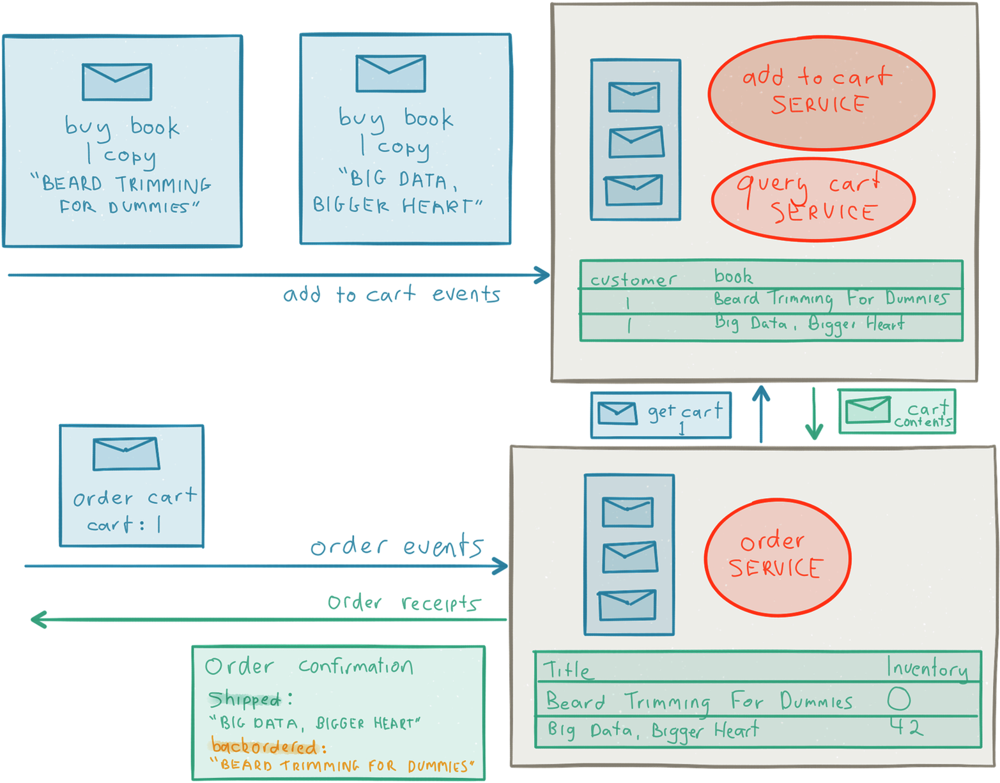
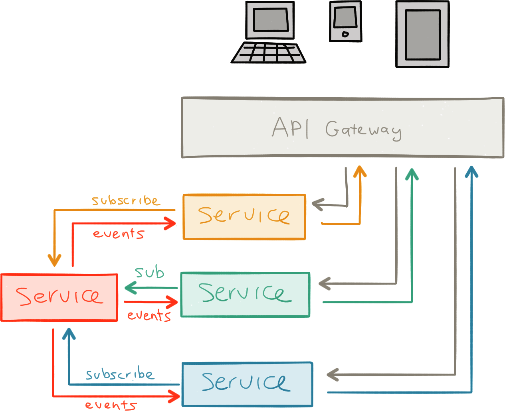

构建微服务
=======================

> 单独的Actor对象不是Actor对象，在Actor系统，Actor对象才是Actor对象。    
-- Carl Hewitt

> 没谁只是一座小岛，   
完全能自保；   
人人都是大陆一块宝，   
整体少不了。   
-- John Donne

至今我们已经对响应式微服务有了很好的认识了。然而按Carl Hewitt的话来说：*单个微服务不是微服务，在微服务系统里，微服务才是微服务*。像人们那样行为独立，所以需要互相通信和协作来解决问题。微服务之间像人们那样合作，这是最有趣的机会以和具有挑战性的问题。

单机版的微服务很容易设计和实现，基于微服务架构难点在于如何把它们串连起来：服务发现、协调、安全、复制、数据一致性、故障转移、部署、与其他系统集成，这些只是其中的一些。

系统需要利用现实
=================

> If you cannot solve a problem without programming. You cannot solve a problem with programming.  --Klang’s Conjecture by Viktor Klang 

基于微服务架构的优点之一就是给你提供一系列的工具来利用现实，通过模仿世界是如何工作来构建系统，包括所有的约束和因素。

我们已经讨论过的康威定律的重点是，当你们组织结构和部门已经准备好了，微服务开发通常是很适合你们的。

另外一个微妙之处，更重要的是接受现实是不一致这点，没有什么东西是绝对的，所有事情都应该是相对的，包括时间和我们现在的经历*[注1]*

信息不可能跑得比光的快，往往要慢得多，这就意味着信息的通信会有延迟*[注2]*。信息通常来自过去，当你想到它的时候，事情已经变成事实。当我们意识或者认识到这些影响，它已经发生了。我们常常都是寻找过去，『现在』只在旁观者的眼里。

微服务会成为现实的一条退路。在单个微服务，我们生活在确定性的安全岛和强一致（[strong consistency](http://www.bailis.org/blog/linearizability-versus-serializability)，请看[ACID](https://en.wikipedia.org/wiki/ACID)）, 这是能够高兴地生活在时间和现在是绝对的这样的安全岛。（请看图3-1）

然而，只要我们离开单个微服务的限界就会进入广阔的『不确定』海洋（分布式的世界，与众不同的世界）。你可能已经听说过构建分布式系统是困难的*[注4]*。是的，正如前所言，同样有一个世界提供了我们可回复性、弹性、隔离的解决方案。从这点来看，我们不能回到单体系统，而是学习如何正确地运用一些原则 、抽象和管理工具。

Pat Helland谈论过这个*[注5]*，他用『内部数据』和『外部数据』的对比来说明这点，内部数据是『我们当前本地表现』，外部数据（事件）是『过去的回忆』，然而服务之间的命令是『将来的希望』。

> 过渡到面向服务构架夺最大挑战之一就是令到程序员明白他们已经别无选择，只能明白在外部，『当时』数据是来自其他服务，『现在』在服务内部。     
--- Pat Helland

让我们想象一下，我们创建一系列的微服务，是时候把它集成起来成为一个系统。有哪些重要的事情我们需要我们去弄明白和实施呢？

服务发现
=========================

> 创新最大的障碍不是无知，而是对知识的幻想。    
--- Daniel J.Boorstin

**现在我们有一系统的微服务需要去协调，有什么可以帮助我们地定位它们？**

为了和其他服务通信，一个服务需要知道其他服务的地址。最简单的方法是所有用到的服务硬编码物理地址和端口，或者在启动的时候把它们写到配置文件。这个解决方案的问题是它会形成一个静态发布模型，这个模型与我们达成微服务的一切事情相矛盾。

服务之间需解耦和可移动性，系统需要弹性和动态的，这可以通过增加一个中间层来解决，这个模式称之为控制反转（[Inversion of Controller, Ioc](https://en.wikipedia.org/wiki/Inversion_of_control)）。这意味着每个服务实际上应该上报当前地址和连接信息给平台。这称之为服务发现（[Service Discovery](https://www.nginx.com/blog/service-discovery-in-a-microservices-architecture/)）
，这也是基于微服务平台的基本部分。

一旦服务的信息已经被持久化，就可以通过一个服务注册（[Service Registry](http://microservices.io/patterns/service-registry.html)）查找到信息，这种模式称为客户端-服务发现（[Client-Side Service Disacovery](http://microservices.io/patterns/client-side-discovery.html)）。另外一个策略需要信息存储和在一个负载均衡器（`load balancer`，像在AWS弹性负载均衡器）或者直接在服务地址引用 （使用依赖注入的方式注入），这种模式称为服务端-服务发现。

**当我们选择一个服务发现的工具的时候，主要考虑哪些因素？**

其中一个存储服务信息的方式是通过基于CP*[注6]*（强一致性）配置存储*[注7]*。这个是简单的方式，因为你要所有的信息都在一个地方，都在一个原子结构里。但是这通常要求你保证强一致性*[注8]*，这会增加可用性的成本，还会需要额外的基础设施集群来发现和管理。

更好的方式是依靠分布式的基于AP*[注9]*的P2P（[Peer-to-Peer](https://en.wikipedia.org/wiki/Peer-to-peer)）技术，像流行的[Gossip](https://en.wikipedia.org/wiki/Gossip_protocol)协议，有时候还与CRDTs*[注10]*（Conflict-Free Replicated Data Type）来简化信息的传递，使用最终一致性（[eventually consistent](http://www.allthingsdistributed.com/2008/12/eventually_consistent.html)）和弹性的方式（不需要额外的基础设施）。*[注11]*

API管理
=========================
> 发送时保守，接收时开放。 --- Jon Postel

**当微服务随着时间独立地进化，管理服务协议和API有什么挑战？**

单个微服务只有当他们能够独立进化的时候才能互相独立和解耦。这个要求他们的数据和[[协议](http://www.reactivemanifesto.org/glossary#Protocol)能够弹性的和随意改变（对于持续存储数据和交换临时信息*[注12]*）。实际上，不同版本之间的协作是决定着是否能够长期管理复杂服务。

伯斯塔尔法则*[注13]*，也称为鲁棒性原则，描述如下『发送时保守，接收时开放。』，对于API设计和协同服务都是一个很好的指导*[注14]*。

这里的挑战包括协议和数据的版本，还有怎么样处理协议和数据的升级和降级。这是一个重要问题，包括可扩展的序列化，维护一个协议，数据转换层，有时候甚至服务本身版本长级*[注15]*，这在DDD中称为『[Anti-Corruption Layer](https://moffdub.wordpress.com/2008/09/21/anatomy-of-an-anti-corruption-layer-part-1/)』，可以加到服务自己本身或者在API GateWay完成。

**假如我有这样一个客户端，为了执行一个任务，需要调用十个不同的服务，每个服务都有不同的API。听起来很复杂，我能如何简化API管理？*

基于微服务的大型系统常常会遇到的场景，这会导致客户端增加不必要的复杂性。针对这些场景最好的方式是，不需要客户端直接与微服务通信，直接让它调用[API Gateway]()服务，请看图3-2

API Gateway负责接收客户端的请求，路由到正确的服务（如果需就进行协议转换），组合结果然后返回给客户端。

这模式的优势在于，通过封装服务的内部结构和它们的API，来简化客户端到服务的协议。如果使用一个集中式的方案很难做到高可用和可扩展性的。可以使用非中心化的技术来代替，正如之前提及的服务发现。

但这个就像所有核心基础服务一样，不应该开发者自己构建，理想的情况是作为底层平台的一部分。

管理通信模式
=====================
>

**我如何处理大规模系统地微服务之间能通信的复杂性？**

ESB的角色仍然存在的价值，现在以一种现代可扩展性消息队列。

系统中的少量微服务，直接P2P（[Point-to-Point]()）通信来完成这任务。无论如何，当你超越这个，允许他们当中每个直接和其他。是时间介绍一些约束了！这个需要一个在发送者和接收者之间逻辑解耦。

其中一个解决方案是使用发布-订阅（[Publish-Subscribe]()）机制，发布者可以向一个Topic发布信息，订阅者监听这个Topic。这个可以使用一个可扩展的消息系统（例如Kafak  或者Amazon Kinesis）或者一个NOSQL数据（可以选择AP风格的数据库像Cassandra或Riak）。

在SOA世界，这个角色通常由ESB来担任。无论如何，在这种情景我不用于桥接单体系统，但是相当于服务发布系统的支柱，用于广播工作或数据，或者像一个系统间整合和消息总线（例如通过[Spark Streaming]()摄取数据到[Spakrk]()）。

有时候使用发布-订阅协议是不足够，例如，当你需要更增强的路由（[routing]()）能力，来允许程序员来自定义多个部分的路由规则，或被用于数据阶段（Stages）转换、充实、拆分和合并（例如，使用用[Akka Streams]()或者[Apache Camel]()）。请看图3-3

集成
===================
>

**如何集成多个系统？**

大多数系统需要一个与外面的通信的方式，不管是消费和（或者）提供信息从（到）其他系统。

当与一个外部的系统通信，特别是一个无法控制的系统，你把你自己处于危险的地步。你w从不能确定其他系统的行为，当通信从[happy path]()分发（当事情可以失败，当系统负载过高等等）。你甚至不能相信其他服务通过被证实的协议。所以你要知道家为什么采取预防措施来保证案例是非常重要的。

第一步定义一个能在系统高负载和不在期望增长的最小化危险的协议。如果使用同步协议（甚至只是协议的子集），你引入了紧耦合，然后你就无能为力，任由其他系统摆布。

避免级联系统要求服务完全解耦和隔离。最好的办法是使用一个全异步的通信协议。相当重要的是，这个协议有一个机制可以容纳大师的流程数据请求，这个称之为[back-pressure]()。这个保证一个快速系统不能由于它基本步分慢而引起负载过高。越来越多的工具和类库开始拥抱[Reative Streams]()规范（类响应式流的产品包括Akka Streams，[RxJava]()，Spark Streaming和Cassandra drivers）。这些使桥接系统使用全异步利用实时流变得可能（增强交互、可靠性和组合其他系统成一个整体）。

对于管理失败服务的方式同样至关重要。如果能捕捉错误，你可以重试。如果错误持续，在一个特定的周期里隔离这些服务，直到服务恢复，这个抽象的方式称为断路器模式（Circuit Breaker pattern，*[注17]*，生产环境级别的断路器实现可以参考[Netflix Hystrix]()和Akka）。请看图3-4。

在过去，集成的角色都是由文件系统承担，或者依赖集中式服务就像关系型数据库或者ESB。但随着扩展性、吞吐量和可用性的要求提高，很多系统都使用非中心化的策略来集成（例如，基于HTTP的REST和[ZeroMQ]()），或者现代的、集中式的、可扩展和弹性的发布-订阅系统（像Kafka和Amazon Kinesis）。

系统集成还包括最近流行的使用事件流平台，可以参考Fast Data]()和实时数据管理。

**客户端到服务的通信，同样需要异步吗？**

能过这本书，我们已经强调需要异步通信、异步执行和异步IO。在服务之间依靠异步消息传递通信相当简单，因为需要全部控制通信协议和实现。但是当外部客户端我们通常不用那么奢华，很多客户端，像浏览器、应用等都是同步通信，在这种情景使用REST通常是一个很好的选择。

重要的不要全部使用同步客户端通信，而应该考虑清楚，然后每个客户端使用单一场景*[注18]*。有很多场景开发人员还是倾向于使用同步的解决方案，应该当真的有需要的时候才使用，例如简单的事情或者更好的交互。

内在的异步但是传统却把它当作同步的场景包括：库存信息（如果它很热销，库存减小很快用户通常需要被通知）；餐馆里的当前菜单（如果它们改变，用户可能想马上知道）；网站的评论（通常是评论完实时显示）；还有广告（马上回应或才根据用户的情况改变）。

我们需要独立地看待每个用户场景，搞清楚客户端与服务之间用什么方式来是自然。这通常要求分析数据完整性约束，找机会去弱化一致性（有序）的约束（可以利用因果关系和读-你的-写*[注19]*），目的是找到用户行为最小化的协调语义：找到贴近现实的最好策略。

安全管理
=========
>

**要是有人问我们如何才能保证不是所有服务都可以调用结算服务，我们应该怎么做？**

区分认证和授权是非常重要的。认证是保证一个客户端（人们或者服务）她说它是谁是正确的（通常使用一个用户名和密码）。授权是允许或拒绝用户访问指定的资源。

它们两个都需要工作正常和需要相互合作。有许多方式可以实现他们，每种方式都有它们自己的优点和缺点。

TSL客户端认证（[TLS Client Certificates]()），也称为共同认证或者两阶段认证，可以为内部服务提供一个很坚实的安全解决方案，这个方案就是部署的时候为服务提供一个私有的Key和证书。在这策略，不仅服务器需要验证客户端的身份，客户端也需要验证服务器身份。这意味这策略是安全，不仅仅防止窃取，但从一个完全不友善的网络攻击来网络拦截和重定向请没请求（例如网络本身，请看图3-5）。通过SSL通信是安全的对于窃听和基于开放的，是个容易理解的标准。但是管理复杂，在平台下面更有优势。

如果服务是基于HTTP，他们可以使用[HTTPS Basic认证]()。这是很容易理解和简单的，但是对于管理所有机器SSL证书很复杂，反身代理不再对请求做缓存。

其中一个优势是它提供两阶段认证，这个与客户端证书方案非常似，在发送证书之前，客户端使用服务器的证书来验证服务器的身份，而服务器使用客户端发送的证书来验证客户端。

另外一个方法是使用Asymmetric Request Signing。在这方案，每个服务都拥有自己私人的Key，这Key来请求时签名。而每个服务的公共的Key则由服务发现服务来产生。这个方案的缺点是，就像一个专用的解决方案，它很容易被窃听或者如果你的网络被攻破就会产生请求重复攻击。

最后，基于Shared Secret的安全，可以使用基于[Hash Message Authentication Code,HMAC]()签名的请求或者夺一个共享在部署阶段的密钥Token。这个方案很简单但很难实现每个服务对需要一个唯一的共享密钥，共享密钥的数量需要对所有服务进行一些排列组合。

数据耦合最小化
=============================
> 沉默不仅仅是美好的，它还可以很小范错 --- Bob Monkhouse

我们已经被单机版所声称一个中心化关系型数据库所纵坏太久了--假设大家都>乐于使用一个[强一致](http://www.bailis.org/blog/linearizability-versus-serializability/)(详见 ACID)模型。但是强一致需要协调者(`coordination`)，这个对于分布式系统来说是很昂贵的，同在扩展性，吞吐时，实时性和可
用性很有限。

协调者的需求--增加处理竞争和一致的成本，这个在`通用扩展规则`([Universal Scalability Law]())有所定义--意味着单个服务不能单独处理但需要等待>数据一致。当设计基于微服务系统时，我们应该严格地遵守服务与服务之间状>态的协调最小化，使微服务享受片刻沉默带来的愉悦('comfortably share silence')[20]。

**我怎么样设计微服务来保证状态协调最小化？**
在传统中，开发者已经使用一个单机版架构连接一个SQL数据库--提供一个"全>局"的一致性。这个模型觉得正常是因为它提供一个全局一致的概念"当前"，一
个绝对表现--这个很直观所以很容易。但是就像我们讨论那样，打破这种结构>和拆分单机版，被隔离的微服务有很多好处。

你需要开始研究数据然后把它作为一个域来梳理它们的关系，保证和业务完整>约束，接近现实(`exploiting reality`)。

这通常包括反范式来处理数据。持续定义系统的一致性(事务)边界，在内容你>可以依靠强一致。然后你应该认这些边界去驱动设计和微服务的范围。尽时减>小你设计的服务有数据依赖和关系依赖，有时要完全消除。数据解耦--它意味>着你不需要当改变的时候去协调。

减小协调成本
======================================
> 请求原谅，总是比得到许可更容易 -- Grace Hopper 

 **我要怎么做才能在设计微服务的时候数据耦合最小化，但是确实有些场景需>要各个微服务之间协调数据?**

 这是我们预料之中的，然而并不是设计中的一个错误。许多用微服务构建的系>统都有数据协调的场景。幸运的是，你在这个设计阶段加入你需要的协调，而>不是一开始耦合后续才删除--这比前者困难得多。

 确实有合理的方式在可扩展和高可用的模式下协调更改数据，但是这要求你所>操作的数据是可组合的。

 *可组合性*在这里是指更必数据的产生能够不暂停他们(或者你自己)，不需要>等待协调者完成。

 接下来我将讨论如何通过通信协议来解决这个问题，这些技术包括业务补偿(`Apology-Orient Programming`)，EDA和ACID 2.0。

 业务补偿的思想建立在原谅比较认可容易这个道理上，当你不能协调(以及不确
 定某些事情)，然后作一个有根据的推测，一个还能把握住的打赌，如果你担心
 ，你会道歉和做一些补偿的动作。

 这种方法很符合现实，人们往往都这个来协调的。其他的例子包括ATM机--网络
 断开的时候取钱，后续再减掉你的金额。还有飞机票超卖--过发放代金券给来>讨好用户。

 这个模型用EDA也非常适合，充分利用异步消息传递和事件溯源。这个模型对于
 区分命令和事件是非常重要的，命令代表着意图影响操作的那边--就是Pat Hellend所说的"未来的希望"。然而事件代表着已经发生的事实--历史是通过当前>的事件来重演。

查询最好选择使用CQRS模式，在写方面，使用事件日志存储事件。分离后读方面，使用关系型数据库或者NoSQL数据库来存储一个丰富结构格式的数据，以支持更强大的查询。对使用事件日志对状态管理和存储还有许多好处，就像易于审计、调试、复制和有故障转移，允许你在任何时间点重放事件流.

ACID 2.0这个概念由Pat Helland提出，他还总结一系列可扩展性的原则、弹性协议和API设计。这缩写意味着对比传统数据库的[ACID]()已经有所改变。

『A』表示组合（`Associative`），表示组内的消息没有强依赖，允许批处理。『C』表示交换的（`Commutative`），与消息的顺序无关。『I』表示独立（`Idempotent`），与消息的复制无关。『D』表示分布式（`Distributed`）。

拥抱这个理念的工具是CRDTs，正如它们都是最终一致，富数据结构（包括count,sets,map和even graphs）组合，汇聚不需要协调。更新操作与顺序无关，通常还可以安全地自动合并。CRDTs相当新，但是已经在生产环境实践了好几年，有一些生产环境级别的类库你可以直接使用（例如，Akka和Riak）。

然而，最终一致性有时候很难做到，因为它会要求我们放弃很多高层业务语意（`high-level business semantics`）。如果遇到这场景选择因果一致性（[causal consistency]()）会是一个很好的权衡。这语意基于人们期望和简单直接的因果关系。好消息是，因果一致性已包含了可扩展性和可用性（甚至还被证实是实现高可用系统的最好方式*[注23]*）。因果一致性通常使用逻辑时刻（`logical time`*[注24]*），也常用于许多NoSQL数据、事件日志存储和分布式日事件流产品（例如Riak和[Red Bull Eventuate]()）。

但对于关系型数据库呢？实际上你同样可以漂亮地使用SQL。在他其中一篇论文*[注25]*，Peter Bailis谈论了在怎么样避免在关系型数据库进行协调，列举很多可以避免协调更改的参考SQL操作（例如，不使用事务）。这些操作包括：等于，唯一ID生成，自增，自减，外键插入和删除，二级索引和视图。

**事务呢？我不能用事务？**

> 一般来说，应用开发者如果使用分布式事务就不能实现大规模可扩展的应用。 --- Pat Helland。

在过去，分布式事务*[注27]*已经用于分布式系统作协调更改。它们执行它们的任务，这个对于并发执行有很昂贵的成本。提供一个假设，你只是世界上唯一使用数据，或者每个人只是坐好排队直到你执行完你的更改。这不是事实的全部，维持这个假设在是相当昂贵的（[extremely costly]()），导致系统变慢，不可扩展和变得脆弱。

对于分布式事务，[Saga模式]()是一个可扩展和弹性的选择方案。它是用于管理长事务的方式，基于长事务的发现，长事务通常组合多个事务步骤，然后综合成一个事务。这个技术是

这个对于有些人来可能很惊奇，但是很多传统的关系型数据库的保证我们已经很清楚，实际上我们也乐于实现可扩展和高可用的方式。Peter Bailis已经表明*[注29]*我们怎么样保证读提交（`Read Commited`）、读未提交（`Read Uncommited`）、你放弃串行化，你可以读到你的写。快照隔离和可重复读。这是最近的研究，但是我相信更的的SQL和NoSQl数据库在不久的将来会开始利用这个。

--------------------------------------------------------------------------
[注1]. 正如阿尔伯特·爱因斯坦在1905年的论文『[论动体的电动力学](http://hermes.ffn.ub.es/luisnavarro/nuevo_maletin/Einstein_1905_relativity.pdf)』 

[注2]. 事实上，信息是延迟的，光速表现一个难以（或者有时候令人沮丧的）达到它的最大值。显而易见的事实是构建网络系统，或者打一个跨越大西洋的VOIP电话。

[注3]. 为了讨论时间的相对性，分布式系统里的现在和过去。我们需要如何改变我们的模型系统，这样我们可以摆脱我们正生活在一个全球一致的幻想。请观看我们的演讲『[“Life Beyond the Illusion of Present”](https://www.youtube.com/watch?v=Nhz5jMXS8gE)』，YouTue视频，53:54，在2016年3月6日举行的Voxxed Days。你可能同样读过Justin Sheehy的文章中谈论的主题『(There is No Now)[https://queue.acm.org/detail.cfm?id=2745385]』

[注4]. 如果你没有亲身经历过，我建议你花一些时间来思考L Perter Deutsch的『[分布式计算的谬论](https://en.wikipedia.org/wiki/Fallacies_of_distributed_computing)』的内在含意。

[注5]. Pat Helland的论文『[内部数据与外部数据对比](http://www.cidrdb.org/cidr2005/papers/P12.pdf)』对构建基于微服务的系统是很有意义的。

[注6]. 在CAP理论里，CP指的是一致性和分区容忍性，意味一个系统选择一致性放弃可用性，来就对网络分区。

[注7]. 基于CP的服务发现系统的例子，包括[ZooKeeper](https://zookeeper.apache.org)和[etcd](https://github.com/coreos/etcd)

[注8]. 在你『知道』服务的位置在毫微秒的时间里，本地可能会改变。所以从『强』一致性得到什么？

[注9]. 在CAP理论里，AP指高可用和分区容忍性。意味着选择高可用，放弃一致性。来面对网络分区。

[注10]. CRDTs是近年来分布系统研究最引人注意理念之一，提供我们丰富，最终一致性，组成数据，不需要通过协调来保证收敛一致性。更多信息请看『[收敛和可交换复制数据类型的综合研究](https://hal.inria.fr/inria-00555588/document)』

[注11]. 基于AP服务发现系统包括[Lightbend响应系统](http://www.lightbend.com/products/lightbend-reactive-platform)，[Netflix Eureka](https://github.com/Netflix/eureka)，[Serf](https://www.serfdom.io)和[regular DNS](https://en.wikipedia.org/wiki/Domain_Name_System)

[注12]. 例如会话状态、认证资格、缓存数据等等。

[注13]. 最初由Jon Postel在1980的[RFC 761](https://tools.ietf.org/html/rfc761)提出。

[注14]. 同样影响着[Tolerant Reader](http://martinfowler.com/bliki/TolerantReader.html)模式。

[注15]. 与现有服务的版本相对，这是一个区别服务的全新语意。

[注16]. API Gateway模型已经在[Netflix](http://techblog.netflix.com/2013/01/optimizing-netflix-api.html)和[Amazon](https://aws.amazon.com/api-gateway)成功运用。
